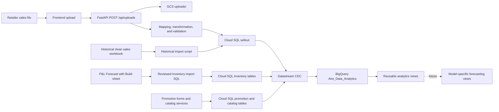

# Sales, Inventory, Promotions, and BigQuery Pipeline

## 1. Purpose and current status

This document records the pipeline work completed for historical sales and
inventory data. It separates verified implementation from future forecasting
work so that testing resources or unconfirmed formulas are not mistaken for
production rules.

The following stages are complete and verified:

- recognised sell-out files can be transformed, validated, and stored in
  Cloud SQL;
- the historical FairPrice sell-out workbook has been loaded into Cloud SQL;
- the inventory schema and FairPrice customer/channel relationship have been
  created in Cloud SQL;
- historical FairPrice inventory metrics have been loaded from the P&L
  workbook;
- sales, inventory, promotion, and catalog tables are replicated from Cloud
  SQL into BigQuery through Datastream;
- a BigQuery historical-inventory view calculates the monthly inventory chain;
- Cloud SQL and BigQuery row counts, historical sales totals, and the inventory
  chain have been validated.

Future forecasting, projected DOH alerts, and recommended sell-in calculations
are not implemented yet. They depend on a confirmed forecast schema and final
business rules.

## 2. End-to-end architecture



Cloud SQL is the operational source of truth. Datastream performs extract and
load through change data capture (CDC). Joining and analytical transformation
belong in BigQuery, rather than in a duplicated pre-joined PostgreSQL table.

## 3. Sell-out ingestion

### 3.1 Normal upload path

1. The frontend sends one or more files to `POST /api/uploads`.
2. The backend stores the original file in the GCS `uploads/` area.
3. The mapping layer recognises the header structure or routes an unknown
   structure through the mapping-review workflow.
4. The transformation layer converts wide retailer columns into canonical
   sell-out rows.
5. Validation checks required fields, dates, and numeric values. Invalid rows
   are rejected and reported without corrupting valid rows.
6. When `CLOUD_SQL_LOAD_ENABLED=true`, valid rows are written to Cloud SQL in
   one transaction.

The Cloud SQL business key is:

```text
(retailer_id, store_code, sku, period_start, period_type)
```

Rows with the same business key are consolidated before writing. Their
`quantity_units` and `revenue` values are summed. The retailer export labels
the source measure `Qty (in EA)`, but the established forecasting contract
currently exposes it as cartons. The pipeline does not perform a numeric unit
conversion; changing this contract requires coordinated forecasting updates.

Normal loads upsert facts on that key. A forced replacement removes facts from
the same `source_file` and inserts the replacement rows within the same
transaction.

### 3.2 Catalog protection

Uploads reuse the shared retailer and store catalog helpers. Existing store
names and populated store formats are preserved; a missing format may be
filled. Missing SKU codes may be inserted, but an uploaded sales file does not
overwrite existing SKU master data such as product name, SKU range, size,
brand, UOM, pack size, or price.

This prevents descriptive data from a retailer export from replacing the
company's approved SKU catalog.

### 3.3 Historical FairPrice sales load

The already-clean `aireOS_fairprice.xlsx` workbook was loaded using the
dedicated historical importer. It validates the canonical columns, supports a
dry run, requires an expected stored-row count before committing, and records a
separate lineage value.

Verified result:

| Check | Result |
| --- | ---: |
| Source workbook rows | 5,920 |
| Consolidated duplicate business-key rows | 305 |
| Rows stored in `public.sellout` | 5,615 |
| SKU count | 9 |
| First period | 2024-07-11 |
| Last period | 2026-08-13 |
| Quantity total | 49,538 cartons |
| Revenue total | 464,806.85 |

Retailer/channel breakdown:

| Retailer | Rows | Quantity | Revenue |
| --- | ---: | ---: | ---: |
| `fairprice_online` (`retailer_id=55`) | 565 | 17,109 | 150,848.40 |
| `fairprice_offline` (`retailer_id=57`) | 5,050 | 32,429 | 313,958.45 |

An exact workbook-to-BigQuery comparison found zero missing keys, zero extra
keys, zero value mismatches, and zero duplicate BigQuery business keys.

## 4. Cloud SQL data model

### 4.1 Sell-out

`public.sellout` stores retailer-channel sales facts:

```text
retailer_id, period_start, period_end, period_type, store_code, sku,
quantity_units, revenue, source_file, loaded_at, data_source
```

The table references `retailers`, `stores`, and `skus`. Its composite primary
key is the sell-out business key described above.

### 4.2 Inventory

Inventory is supplied at combined customer level, while sales and promotions
remain separated by retailer channel. Five normalized tables support this:

| Table | Purpose |
| --- | --- |
| `customers` | Combined customer identity, currently `fairprice` |
| `customer_retailers` | Maps one customer to its retailer channels |
| `inventory_metric_types` | Defines allowed metrics and units |
| `inventory_metrics` | Stores historical, planned, forecast, recommended, and derived metric snapshots |
| `customer_doh_targets` | Effective-dated target DOH values |

The current FairPrice relationship is:

```text
customer: fairprice
  -> retailer 55: fairprice_online
  -> retailer 57: fairprice_offline
```

This lets inventory stay combined without incorrectly merging the sell-out and
promotion channel data.

The initial FairPrice target is 30 days, effective from 2026-01-01. It is
effective-dated so a future policy change can be added without rewriting
history.

Supported inventory metric types are:

| Metric | Unit | Meaning |
| --- | --- | --- |
| `opening_inventory` | cartons | Inventory at the start of the month |
| `sell_in` | cartons | Cartons supplied during the month |
| `sell_out_base` | cartons | Base sell-out excluding building blocks |
| `sell_out_building_blocks` | cartons | Manual incremental sell-out for known activities |
| `closing_inventory` | cartons | Inventory remaining at month end |
| `forecasted_daily_sellout_rate` | cartons/day | Forecasted average daily sell-out |
| `doh` | days | Days of inventory on hand |

Each metric has a `value_type` and `as_of_date`. This preserves the historical
state of manual plans, model forecasts, recommendations, derived values, and
actuals instead of overwriting one with another. Source columns also retain
file, sheet, cell, formula, load time, and data-source lineage.

### 4.3 Promotions and catalog

Promotions and their coverage remain normalized:

```text
promotions -> promotion_stores -> stores -> retailers
promotions -> promotion_skus   -> skus
```

`promotion_stores` is required because one promotion can apply to many stores.
`promotion_skus` provides the corresponding many-to-many SKU coverage.

## 5. Historical inventory load

The source was the `Forecast with Build` sheet in the historical P&L workbook.
The reviewed SQL import stages the extracted values, validates them, and
upserts them idempotently into `inventory_metrics`.

Verified result:

| Metric | Value type | Rows | SKUs | Period |
| --- | --- | ---: | ---: | --- |
| `opening_inventory` | `derived` | 132 | 9 | Jan 2025-Jul 2026 |
| `sell_in` | `actual` | 101 | 9 | Jan 2025-Jul 2026 |
| `sell_out_base` | `actual` | 132 | 9 | Jan 2025-Jul 2026 |
| `sell_out_building_blocks` | `manual_plan` | 9 | 9 | Jul 2026 |
| `doh` | `derived` | 126 | 9 | Jan 2025-Jul 2026 |
| **Total** |  | **500** | **9** | **Jan 2025-Jul 2026** |

July 2026 is treated as the last historical inventory month in this import.
Later months in the workbook are planning/forecasting territory and were not
loaded as historical actuals.

## 6. Datastream replication to BigQuery

### 6.1 Configuration

| Setting | Value |
| --- | --- |
| GCP project | `aire-data` |
| Cloud SQL database | `promotions` |
| Datastream stream | `aireos-to-analytics` |
| Region | `us-central1` |
| Source profile | `aireos-cloudsql-source` |
| Destination profile | `aireos-bigquery-destination` |
| Publication | `aireos_sellout_pub` |
| Replication slot | `aireos_analytics_slot` |
| Replication user | `datastream_sellout` |
| BigQuery dataset | `aire-data.Aire_Data_Analytics` |
| Write mode | Merge |
| Maximum staleness | 15 minutes |

Logical decoding is enabled and the replication user has schema usage and
`SELECT` privileges. Default privileges were also granted so future tables can
be made readable without repeating the earlier permission problem.

The previous stream and `aire-data.Aire_Data` replica remain temporarily as a
rollback path until application consumers have been moved to the analytics
dataset. As of 2026-10-01 the sales dashboard reads
`Aire_Data_Analytics.public_sellout` instead of `Aire_Data`.

### 6.2 Replicated tables

The publication and stream currently include twelve tables:

```text
customer_doh_targets
customer_retailers
customers
inventory_metric_types
inventory_metrics
promotion_skus
promotion_stores
promotions
retailers
sellout
skus
stores
```

They appear in BigQuery using the `public_` prefix, for example
`public_sellout` and `public_inventory_metrics`.


### 6.3 Final source/destination verification

Cloud SQL and BigQuery counts matched exactly:

| Table | Rows |
| --- | ---: |
| `customer_doh_targets` | 1 |
| `customer_retailers` | 2 |
| `customers` | 1 |
| `inventory_metric_types` | 7 |
| `inventory_metrics` | 501 |
| `promotion_skus` | 123 |
| `promotion_stores` | 1,849 |
| `promotions` | 41 |
| `retailers` | 2 |
| `sellout` | 5,615 |
| `skus` | 9 |
| `stores` | 54 |

Because the stream uses a 15-minute maximum staleness, a normal BigQuery query
may briefly show an older count. For a verification query that must use the
freshest applied data, start the script with:

```sql
SET @@max_staleness_override = INTERVAL 0 SECOND;
```

`RUNNING` is the correct steady state for a CDC stream; it remains active to
replicate future inserts, updates, and deletes. Completion is checked per
object through its `backfillJob.state`, not by expecting the stream itself to
stop.

## 7. BigQuery historical inventory view

`aire-data.Aire_Data_Analytics.v_inventory_history` converts metric rows into one
customer/SKU/month history and calculates a consistent inventory chain.

For each month:

```text
net inventory change = sell-in - sell-out base - sell-out building blocks
ending inventory     = opening inventory + net inventory change
next opening         = previous ending inventory
```

The view selects the applicable metric snapshot, pivots the metric names into
columns, joins customer and SKU descriptions, and retains the workbook opening
value and variance for auditing.

The original version produced 12 opening mismatches. For one SKU, the first
non-null source opening occurred in August, but July's net movement was also
being applied, which counted the same inventory twice. The seed was corrected
to use each SKU's earliest monthly row and treat a blank first opening as zero.

Final validation:

| Check | Result |
| --- | ---: |
| Monthly rows | 134 |
| SKUs | 9 |
| First period | 2025-01-01 |
| Last period | 2026-07-01 |
| Opening mismatches | 0 |
| Lowest calculated ending inventory | 0 cartons |
| Highest calculated ending inventory | 1,466.333333333333 cartons |

The 134 view rows are monthly customer/SKU records after the 500 long-format
metric rows have been pivoted and chained; they are not missing raw metric
records.

## 8. Confirmed business meaning

- FairPrice online and offline remain separate for sell-out and promotions.
- FairPrice inventory is combined at customer level.
- Historical workbook quantities are currently exposed as cartons for the
  established forecasting contract. The retailer source header is
  `Qty (in EA)` and no conversion is performed, so the semantic unit remains a
  documented business-definition issue rather than an ingestion calculation.
- `sell_out_base` is the ordinary sell-out quantity.
- `sell_out_building_blocks` is a manual additional quantity allocated when
  the business expects known promotion or activity uplift.
- Opening inventory for a month should equal the preceding month's calculated
  ending inventory once the chain has started.
- The client monitors DOH and follows up when stock appears low; sell-in contact
  is not necessarily made on a fixed monthly schedule.
- The current target DOH for FairPrice is 30 days. The client indicated that a
  customer with a 30-45 day target is generally considered low below about 20
  days, but this alert threshold has not yet been formalized in the schema.

## 9. What has deliberately not been implemented

The old `Aire_Data_Sandbox` forecasting tables and models are testing
resources that the forecasting team identified as outdated. They must not be
treated as the final forecast input contract.

The following logic remains pending:

- the production future monthly forecast table/view and its ownership;
- a configurable reorder/alert threshold separate from target DOH;
- the exact forecast window used for the daily sell-out rate;
- timing of recommended sell-in, order lead time, and treatment of outstanding
  orders;
- projected closing inventory, projected DOH, low-DOH alerts, and recommended
  sell-in;
- a BigQuery forecasting-input view joining sales, inventory, promotions, and
  future forecasts at the agreed grain;
- frontend inventory entry, review, and monitoring screens.

A possible immediate-replenishment formula is:

```text
recommended sell-in = max(0, ceil(target DOH * forecast daily rate - current inventory))
```

However, it should not be implemented until the forecasting team and client
confirm the timing and input definitions. A different formula is needed if the
business intends to cover the current month's forecast demand and still finish
the month at target stock.

## 10. Repository file guide

| File | Responsibility |
| --- | --- |
| `backend/app/routers/uploads.py` | Single upload API entry point and mapping/load orchestration |
| `backend/app/services/sellout_service.py` | Consolidates rows, protects catalog data, and upserts sell-out facts |
| `backend/app/services/catalog_service.py` | Shared retailer/store catalog access and preservation rules |
| `backend/app/services/sql.py` | Shared Cloud SQL connection lifecycle |
| `backend/migrations/001_create_sellout.sql` | Cloud SQL sell-out table and indexes |
| `backend/migrations/002_create_inventory_metrics.sql` | Customer, inventory metric, and target-DOH schema |
| `backend/scripts/import_historical_sellout.py` | Safe dry-run/commit path for canonical historical sales workbooks |
| `outputs/inventory-history-import/003_load_fairprice_inventory_history.sql` | Reviewed historical inventory staging and load script |
| `backend/tests/test_sellout_service.py` | Sell-out consolidation, replacement, lineage, error, and batching tests |

The reusable inventory, sales, promotion, and forecasting-foundation view
definitions are versioned under `bigquery/views/`.

## 11. Recommended next steps

1. Ask the forecasting team to publish the final future forecast schema,
   including grain, keys, units, forecast horizon, model/run identifiers, and
   snapshot date.
2. Confirm with the client whether the low-stock threshold is fixed at 20 days
   or must be effective-dated by customer, like target DOH.
3. Confirm sell-in lead time and how existing/unreceived purchase orders affect
   the recommendation.
4. Build model-specific BigQuery views only after those inputs are confirmed.
5. Add the inventory entry and DOH monitoring UI against the agreed API/view
   contracts.

The initial reusable view layer is defined in
`bigquery/views/001_create_forecasting_foundation_views.sql`. It preserves full
promotion event detail, aggregates safe monthly promotion features, retains the
online/offline sales split at combined customer level, and exposes sales,
promotion, and inventory records together without a row-multiplying raw join.

### Reusable view validation

The reusable BigQuery views were deployed and validated successfully:

| Check | Verified result |
| --- | ---: |
| Raw/enriched sell-out rows | 5,615 / 5,615 |
| Customer-monthly sales duplicate keys | 0 |
| Monthly promotion feature duplicate keys | 0 |
| Forecasting foundation duplicate keys | 0 |
| Expected/actual promotion event rows | 5,547 / 5,547 |
| Raw/monthly sales quantity | 49,538 / 49,538 cartons |
| Raw/monthly revenue | 464,806.85000000219 / 464,806.85000000219 |
| Forecasting foundation rows | 197 |
| Forecasting foundation SKUs | 9 |
| Foundation period | Jul 2024-Dec 2026 |
| Rows with sales | 156 |
| Rows with promotions | 108 |
| Rows with inventory | 134 |
| Rows with all three domains | 63 |

The future October-December 2026 preview records correctly contain promotions
and target DOH but no historical sales or inventory. This is intentional: the
foundation uses the union of all domain month keys, so future promotion-only
months are retained for later forecasts instead of being discarded.
